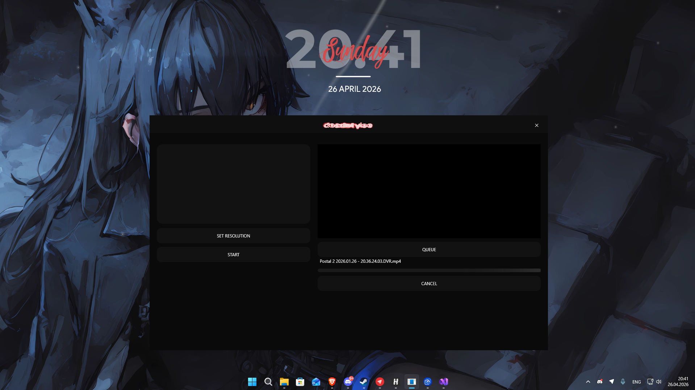

# 🎬 VideoResizer


A simple WPF application for fast video resizing using FFmpeg.

---

## ⚡ Features

- Drag & Drop video support
- Queue system for batch processing
- Custom resolution settings
- Built-in FFmpeg processing
- Live progress bar
- Video preview
- Lightweight UI (WPF)

---

## 🖥️ Requirements

- Windows 10 / 11
- .NET Framework 4.8 (or .NET 8 if migrated)
- FFmpeg (included in project or placed next to exe)

---

## 📦 Installation

### Option 1 — Portable version
1. Download `VideoResizer_64bit portable.exe`
2. Run `VideoResizer_64bit portable.exe`

### Option 2 — Manually
1. Download `VideoResizer_64bit.zip`
2. Extract zip file 
3. Run VideoResizer.exe

---

## 🚀 Usage

1. Drag and drop a video into the app
2. Or click the drop area to select a file
3. Set desired resolution
4. Click **START**
5. Wait for processing

---

## ⚙️ How it works

The app uses FFmpeg internally:

- Scales video to selected resolution
- Processes files in queue
- Replaces original file after processing

Example command:

```bash
ffmpeg -i input.mp4 -vf scale=1920:1080 -c:v libx264 -preset ultrafast output.mp4


**

P.S This is my first project don't judge me harshly