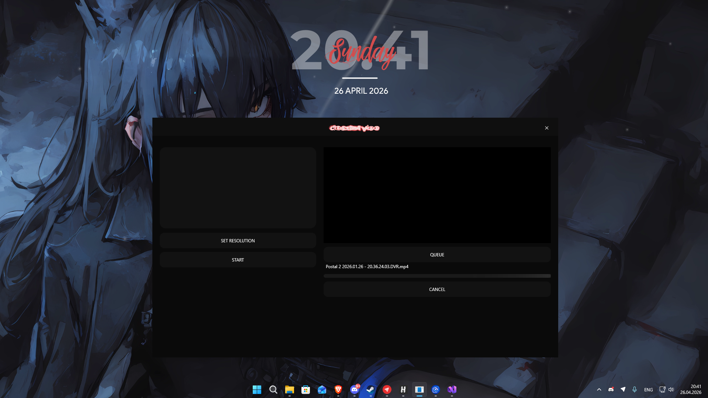

🎬 VideoResizer

Простое WPF-приложение для быстрого изменения разрешения видео с помощью FFmpeg. 
перетаскивайте файлы, формируйте очередь, задавайте разрешение и обрабатывайте быстро с прогрессом и предпросмотром.

---
⚡ Возможности
•	Поддержка Drag & Drop
•	Система очереди для пакетной обработки
•	Пользовательские настройки разрешения
•	Встроенное использование FFmpeg
•	Индикатор прогресса в реальном времени
•	Предпросмотр видео
•	Лёгкий интерфейс на WPF
---

🖥 Требования
•	Windows 10 / 11
•	.NET Framework 4.8 (или .NET 8 при миграции)
•	FFmpeg (включён в релиз или размещён рядом с exe)
---

📦 Установка
Вариант 1 — Портативная версия
1.	Скачать VideoResizer_64bit_portable.exe
2.	Запустить VideoResizer_64bit_portable.exe
Вариант 2 — Ручная установка
1.	Скачать VideoResizer_64bit.zip
2.	Распаковать архив
3.	Запустить VideoResizer.exe
---

🚀 Использование
1.	Перетащите видео в окно приложения или кликните по области для выбора файла
2.	Выберите нужное разрешение
3.	Нажмите «START»
4.	Дождитесь завершения обработки (файл помещается в очередь и обрабатывается последовательно)
---

⚙️ Как это работает
Приложение использует FFmpeg для изменения разрешения и кодирования:
•	Масштабирует видео до выбранного разрешения
•	Обрабатывает файлы из очереди
•	По умолчанию заменяет/сохраняет выходной файл в указанную папку

Пример используемой команды:

ffmpeg -i input.mp4 -vf scale=1920:1080 -c:v libx264 -preset ultrafast output.mp4
---
